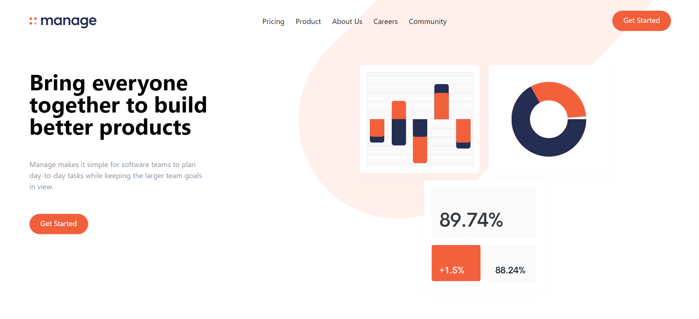
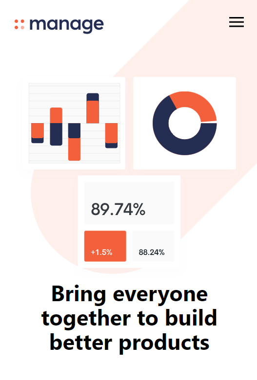

# Frontend Mentor - Manage landing page solution

This is a solution to the [Manage landing page challenge on Frontend Mentor](https://www.frontendmentor.io/challenges/manage-landing-page-SLXqC6P5). Frontend Mentor challenges help you improve your coding skills by building realistic projects. 

## Overview

### The challenge

To create a landing page for the organization named Manage. We have used Tailwind and custom CSS to style this landing page.

### Screenshot

This image shows the design of the Manage landing page and the layout is for the desktop view.

This is the mobile view of the Manage landing page.

### Links

- Solution URL: [Add solution URL here](https://your-solution-url.com)
- Live Site URL: [Add live site URL here](https://your-live-site-url.com)

## My process

### Built with

- Semantic HTML5 markup
- CSS custom properties
- Tailwind CSS

The HTML code of the Manage landing page contains a header, a main section with a call-to-action (CTA) area, and a footer. The header includes a logo and a hamburger menu button, and the main section contains text and an image. The footer includes links to various pages and social media accounts. The HTML code also includes references to external CSS and JavaScript files.

The CSS code defines styles for the HTML code provided. It sets a background image for the body and a separate background image for the #cta section. It also defines styles for a hamburger menu button. Additionally, it includes media queries to adjust the background image and the #cta section for smaller screen sizes.

The Javascript code adds a click event listener to a button with an ID of "menu-btn". When the button is clicked, the code toggles a class of "open" on the button, and toggles the classes "flex" and "hidden" on a navigation menu element with an ID of "menu". This allows the menu to be hidden or shown when the button is clicked.

### What I learned

I have learned how to create a responsive navigation menu for a web page. The HTML code defines the structure of the navigation menu using a nav element and a ul element with several li elements representing the menu items. The CSS code is used to style the navigation menu and includes media queries to adjust the layout for smaller screen sizes. The JavaScript code is used to toggle the visibility of the navigation menu on smaller screens when the menu button is clicked. The classList.toggle method is used to add and remove the open class from the button, and the flex and hidden classes from the navigation menu.

### Continued development

Here are some potential further developments for this project:

Responsive design: The current design only includes a media query for mobile screens. A more comprehensive approach would be to include additional breakpoints to ensure the site looks good on all screen sizes, including tablets and desktops.

Accessibility improvements: The current design does not include any accessibility features such as proper semantic markup, ARIA labels, or keyboard navigation. Adding these features would improve the user experience for people with disabilities.

Content updates: The current design includes placeholder text and images. Updating the content to be more relevant and engaging could improve the overall quality of the site.

Interactive features: Adding interactive features such as animations, hover effects, or interactive forms could make the site more engaging and fun to use.

Backend functionality: The current design only includes front-end code. Adding a backend could enable features such as user authentication, dynamic content, and database storage.

## Author

- Frontend Mentor - [@HarshaVardhanNandamuri](https://www.frontendmentor.io/profile/HarshaVardhanNandamuri)
- Linkedin - [@Bhanu Harsha Nandamuri](https://www.linkedin.com/in/bhanu-harsha-nandamuri-b31a80149/)
